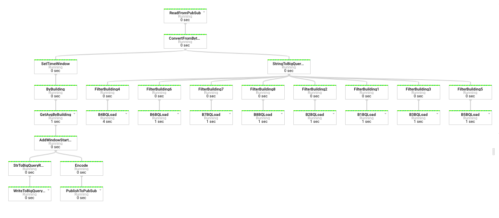
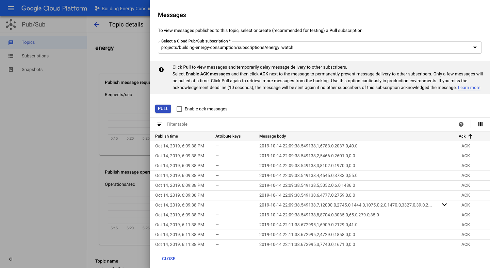
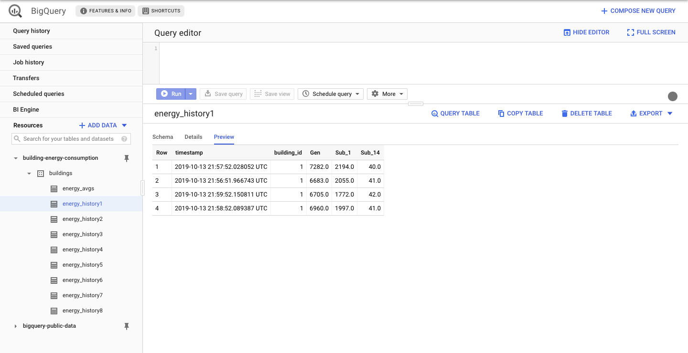
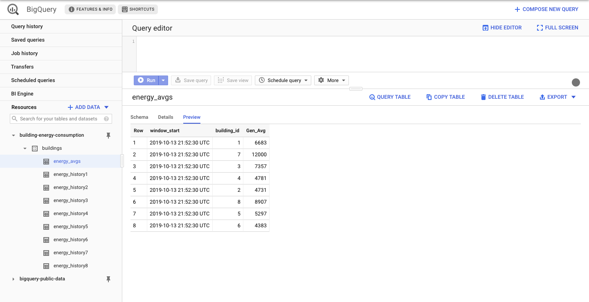
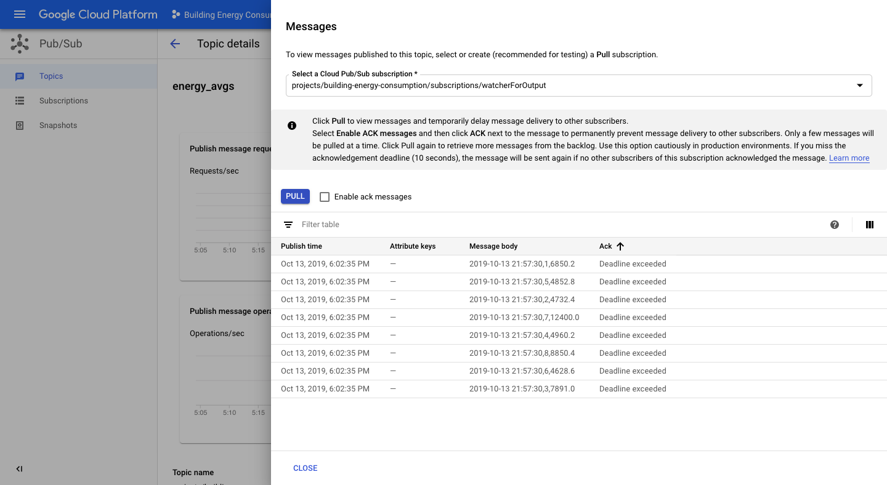

# Building Energy Consumption

## Introduction

This is a data engineering project based on the Google Cloud Platform, specifically utilizing the Pub/Sub-Dataflow-BigQuery severless stream processing. The raw data was sourced from [Schneider Electric Exchange](https://shop.exchange.se.com/home), under ["Buildings energy consumption measurements"](https://shop.exchange.se.com/apps/39117/buildings-energy-consumption-measurements#!overview) There are two problems that this project aims to solve:

1. Batch load each building's energy consumption data for data analysts or data scientists to perform analysis.
1. Calculate the average energy consumption of each building in real time and provide the data in real time for monitoring.

## Table of Contents

1. [Architecture](#architecture)
1. [Data Simulation](#data-simulation)
1. [Data Pipeline](#data-pipeline)
1. [BigQuery Schema](#)
1. [Results](#results)
1. [How To Run on GCP](#how-to-run-on-gcp)
1. [Licensing](#licensing)

## Architecture

</img>

- Ingestion Layer (Compute Engine, Cloud Pub/Sub):

  - In a realistic scenario, the sensor to Pub/Sub architecture would look something like this:
       

     
          <i>Source: <a href="https://cloud.google.com/community/tutorials/cloud-iot-gateways-rpi)*">"Using Cloud IoT Core gateways with a Raspberry Pi"</a></i>

  - Since the original data is a historical data of the energy consumption, a compute engine instance was used to simulate the ingested data published to Cloud Pub/Sub architecture.

- Batch Layer (Cloud Dataflow, BigQuery): With the Apache Beam's PubsubIO, the messages published from the ingestion layer was read, translated into BigQuery rows, and were loaded to BigQuery.

- Stream Layer (Cloud Dataflow, BigQuery, Cloud Pub/Sub): On top of ingesting the data using PusubIO with the batch layer, the real time analysis of running average of the main meter readings of each building was conducted. The results were both stored in BigQuery and also published to a separate topic on Cloud Pub/Sub in case of creating a web interface for serving the real time data publicly.

## Data Simulation

### Structure of the Original Data

As seen on the [original csv](./data/buildings-energy-consumption-clean-data.csv) exported from [Schneider Electric Exchange](https://shop.exchange.se.com/home), the original schema of the csv was:

| Timestamp | 1_Main Meter_Active energy | 1_Sub Meter Id1_Active energy | ... | 8_Sub Meter Id9_Active energy |
| --------- | -------------------------- | ----------------------------- | --- | ----------------------------- |
| 2017-04-02T02:15:00-04:00 | 17779.0 | 3515.0 | ... | 361.0 |

The timstamp used the UTC ISO format, and the energy readings were taken every fifteen minutes, read in Watt-hour.

### Restructured Raw Data for Simulation

Since the original data was cleaned manually and all of the building data were gathered into a single table  by whoever posted the data on the online library, I wanted to adjust the schema to something more realistic in a scenario where multiple sensors from multiple buildings were sending their data. I assumed that the IoT Gateway that I tried to simulate received the data on building to building basis, and performed the most minimal function possible to reach Cloud Pub/Sub (e.g. gathering multiple sensor data with common building location to be aggregated into a single row). Example schema of building 1 and building 8 are shown below:

| timestamp | building_id | Gen | Sub_1 | Sub_3 |
| --------- | ----------- | --- | ----- | --- |
| YYYY-MM-DD HH:MM:SS | 1 | 17779.0 | 3515.0 | 1942.0 |

| timestamp | building_id | Gen | Sub_1 | Sub_10 | Sub_11 | Sub_9 |
| --------- | ----------- | --- | ----- | ------ | ------ | ----- |
| YYYY-MM-DD HH:MM:SS | 8 | 16039.0 | 4471.0 | 253.0 | 2938.0 | 361.0 |

### Pub/Sub, SpeedFactor, and Event Timestamps

When running the `send_meter_data.py` to lauch the data publishing simulation to Pub/Sub, the user must provide the `speedFactor`. The `speedFactor` allows the user to quicken the simulation of data. For example, if the user provides the SpeedFactor of 60, one event row of the original data will be sent per minute. More accurately, after the change in the schema, 8 rows will be published per minute (although the order of arrival of the messages won't be the same every time due to latency). To match the original data time increment, the user must provide the SpeedFactor of 900, meaning one event per 15 minutes.

Along with splitting the original rows of data in `send_meter_data.py` as explained in [Restructured Raw Data for Simulation](#restructed-raw-data-for-simulation), event timestamps were altered to match real time prior to publishing on Pub/Sub to reflect the appropriate real time behavior.

## Data Pipeline

The Dataflow DAG above provides the step by step view of how the data was ingested, aggregated, and loaded, or stream inserted. Starting from the top, the data was read and ingested from Cloud Pub/Sub. Then, the pipeline was branched to the stream (on the left), and batch (on the right) processing. In the stream processing, the `SlidingWindows` was set, and the general meter readings of each building was aggregated according to the window created to calculate the Mean. The `SlidingWindows` took two requird arguments -- `size` and `period`. The size indicates how wide the window should be in seconds, and the period indicates for how long (in seconds) the aggregation must be recalculated. A sliding window of 60 seconds with period of 30 seconds would look something like this:

 

     
          <i>Source: <a href="https://beam.apache.org/documentation/programming-guide/)*">"Beam Programming Guide"</i></a>

## Results

## How To Run on GCP

## Licensing

This project uses the [Apache License 2.0](LICENSE)
